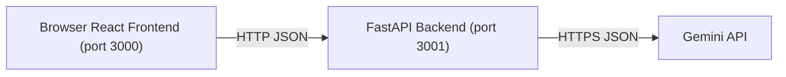

# AI Copilot Application – Integration Guide

## Overview

This repository hosts a full‑stack AI Copilot chat application composed of:
- A React frontend that renders the chat UI and calls REST APIs.
- A FastAPI backend that manages chat sessions, stores in‑memory history, and calls the Gemini API to generate replies.

The default developer experience runs the frontend on port 3000 and the backend on port 3001. The frontend uses Axios to call the backend, and the backend enables CORS to allow calls from the frontend origin.

### Architecture



## Environment variables

Both containers use environment variables to control runtime behavior.

### Frontend (React)
- REACT_APP_API_BASE_URL: The base URL of the backend API. Defaults to http://localhost:3001. 
  Place it in a .env file under ai_copilot_frontend or export in your shell. Changes require restarting the dev server.

Optional:
- PORT: The port for the React dev server (Create React App). Defaults to 3000.

### Backend (FastAPI)
- GEMINI_API_KEY (required): API key for Google Gemini. The backend returns HTTP 500 with a clear error if this is not set.
- GEMINI_MODEL (optional): Gemini model name. Defaults to gemini-1.5-flash.
- ALLOWED_ORIGINS (optional): Comma‑separated origins allowed by CORS. Defaults to http://localhost:3000. Example: http://localhost:3000,http://127.0.0.1:3000,https://your.dev.host:3000
- PORT (optional): Informational variable to track the intended port. The server runner should be started with the same port (3001 by default).

## Setup and run

### 1) Backend on port 3001
1. Open a terminal:
   - cd ai-copilot-chat-application-4349/ai_copilot_backend
   - (Optional) python -m venv .venv && source .venv/bin/activate  # Windows: .venv\Scripts\activate
   - pip install -r requirements.txt
2. Create a .env file:
   ```
   GEMINI_API_KEY=your_key_here
   GEMINI_MODEL=gemini-1.5-flash
   ALLOWED_ORIGINS=http://localhost:3000,http://127.0.0.1:3000
   PORT=3001
   ```
3. Start the server on port 3001:
   - uvicorn src.api.main:app --reload --port 3001
4. Verify:
   - Health: http://localhost:3001/  returns {"status":"ok"}
   - API docs (OpenAPI/Swagger): http://localhost:3001/docs
   - OpenAPI JSON: http://localhost:3001/openapi.json

### 2) Frontend on port 3000
1. Open a second terminal:
   - cd ai-copilot-chat-application-4348/ai_copilot_frontend
   - npm install
2. Configure backend base URL (optional if you use the default):
   - Create .env with:
     ```
     REACT_APP_API_BASE_URL=http://localhost:3001
     ```
3. Start the app on port 3000:
   - npm start
   - If port 3000 is in use, you can force it: PORT=3000 npm start
4. Open http://localhost:3000. The header shows the “API: …” badge with the current backend URL.

## API endpoints (served by backend)

- GET /: Health check, returns {"status":"ok"}.
- GET /api/sessions: Returns all sessions (SessionListResponse).
- POST /api/sessions: Creates a new session (SessionCreateResponse).
- GET /api/sessions/{session_id}/history: Returns the message history for the session (HistoryResponse).
- POST /api/chat: Sends a message to Gemini for a given session_id and returns the assistant reply (ChatResponse).

See ai-copilot-chat-application-4349/ai_copilot_backend/interfaces/openapi.json for the full schema, or browse http://localhost:3001/docs when the server is running.

## CORS configuration

The backend sets CORS using FastAPI’s CORSMiddleware and reads ALLOWED_ORIGINS from the environment. Provide a comma‑separated list of origins that are allowed to call the backend, including scheme, host, and port, for example:
- http://localhost:3000
- http://127.0.0.1:3000
- https://your.dev.host:3000

Important notes:
- If allow_credentials is true (the default in this app), do not use "*" for allow_origins. List explicit origins instead.
- If your React dev server runs on a different port or host, update ALLOWED_ORIGINS and restart the backend.

## Troubleshooting

### 1) CORS preflight or “Network error” in the frontend
Symptoms include Axios reporting “Network error (possible CORS issue)” or failed OPTIONS requests in the browser DevTools.
- Confirm the frontend origin (exact scheme+host+port) is present in ALLOWED_ORIGINS on the backend.
- Ensure the backend is actually running on the URL configured in REACT_APP_API_BASE_URL.
- Avoid mixing https on the frontend with http on the backend; browsers block mixed‑content requests.
- After changing ALLOWED_ORIGINS, restart the backend.

### 2) Missing or invalid GEMINI_API_KEY
- The backend returns HTTP 500 with detail "GEMINI_API_KEY is not configured on the server." if the key is missing.
- Ensure GEMINI_API_KEY is set in ai_copilot_backend/.env or exported in your shell before starting uvicorn.
- For invalid or expired keys, the backend returns HTTP 502 with detail prefixed by "Gemini API error: …". Replace the key and retry.

### 3) Gemini API 4xx/5xx responses
- 400/401/403 often indicate bad key, missing quotas, or model access issues. Verify GEMINI_API_KEY and GEMINI_MODEL (default gemini-1.5-flash).
- Occasional 5xx from the provider can be transient. Retry after a short delay.

### 4) Port conflicts or connectivity
- If port 3001 is in use, run the backend on another port and update REACT_APP_API_BASE_URL accordingly.
- If the React dev server uses a different port than 3000, add that origin to ALLOWED_ORIGINS.

## Replacing the in‑memory store with a database

The current backend uses InMemorySessionStore, which is thread‑safe but non‑persistent. To persist sessions and messages, implement a DB‑backed store with the same public interface:
- has_session(session_id: str) -> bool
- create_session(title: Optional[str]) -> Dict[str, Any]
- list_sessions() -> List[Dict[str, Any]]
- append_message(session_id: str, role: str, content: str) -> Dict[str, Any]
- get_history(session_id: str) -> List[Dict[str, Any]]

Then replace the store instance in src/api/main.py:
- From: store = InMemorySessionStore()
- To: store = YourDatabaseSessionStore(...)

Keep APIs and returned fields consistent with SessionModel and MessageModel.

## OpenAPI: generating ai_copilot_backend/interfaces/openapi.json

You can obtain the API spec in two ways:
1) Live server: Start the backend and GET http://localhost:3001/openapi.json, then save the response to ai_copilot_backend/interfaces/openapi.json.
2) Script (no server required):
   - cd ai-copilot-chat-application-4349/ai_copilot_backend
   - python -m src.api.generate_openapi
   This writes interfaces/openapi.json using the application’s current routes.

## Verification checklist

- Backend runs on :3001 with a valid GEMINI_API_KEY and correct ALLOWED_ORIGINS.
- Frontend runs on :3000 and points to the correct REACT_APP_API_BASE_URL.
- Health check returns {"status":"ok"} and Swagger UI opens at /docs.
- You can create a session and exchange chat messages successfully.
